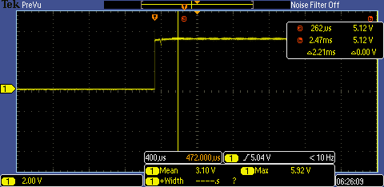
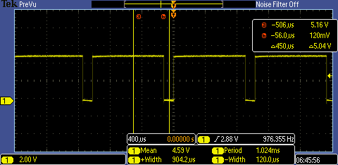
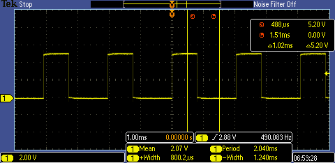
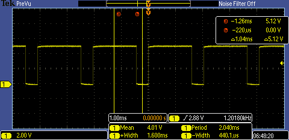

# Open Loop Motor Control Characterisation report - B37VB 2024 Group 3 (Torin & David) 
The goal of the assignment is to characterise the performance of an open-loop control system to control the two drive servos on the robot. 
As this is an open loop system, there is no feedback to ensure that instructions are properly being followed therefore it is imperative to
characterise the responses of both motors to changes in operating speeds.

## Pulse Width Modulation
Pulse width modulation is a current control technique that allows for efficient variable control of motors. It works by pulsing DC current
with different lengths of time depending on how much current is required. This creates a number of square waves with different width (More 
current is given by longer widths).

## Method
We used PWM signals to control our motor speeds with a max PWM value of 255 for maximum speed. 
At first, we discovered that our servos were not running at the same speed. When both were set to the same value the robot would turn left,
this indicated that the left servo was weaker than the right one. In order to find the proper speed to run the left servo at, we edited 
the code to maintain the right servo at the same speed while slowly ramping the speed of the left one up after certain intervals. A flashing
light would indicate moments where the speed changed, using this method we could wait until our robot began driving straight and then recorded
the value for the corresponding left PWM value. This process was repeated to find the corresponding left servo PWM values for small, medium and
large values of the right servo. Table 1 displays our collected results from the motor speed test. This involved letting the robot drive for 1 
meter in a straight line while recording the time taken using a stopwatch. We tested each speed 3 times and averaged the values.

## Results

Table 1: Motor speed test.
| Left Servo Speed - right Servo Speed (Pwm Value) |Time 1 (s)|Time 2 (s)|Time 3 (s) | avg Speed (m/s) |
|--------------------------------------|------|------|--------|-----------------|
|              125 - 100               |8.64  | 8.56 | 8.61   |      8.60       |
|              225 - 200               |4.03  | 4.09 | 4.11   |      4.08       |
|              255 - 255               |3.52  | 3.58 | 3.51   |      3.54       |

In the images below the differences between specific PWM values can be seen.

Figure 1: Both left and right servo PWM max (255) value. 

Figure 2: Left PWM (125) low value.

Figure 3: Left PWM (225) mid value.

Figure 4: Right PWM (100) low value.

Figure 5: Right PWM (200) mid value.

## Conclusion
In conclusion, this motor characterisation task allowed us to gain a deeper understanding of the funcionality of the Arduino UNO board, we explored
the code required to make the robot funcion and manipulated our values to change its behaviour. we found that the differences between the two servos
was not linear, when both were at maximum values the robot would drive straight but on low values the correct left servo PWM value had to be calculated.
Our results show a direct relationship between the input PWM value and the speed of the robot. When the PWM values of the robot were doubled, the speed 
was doubled, this suggests that the results are accurate. We also managed to capture images of our PWM waves using the oscilloscope (Figures 1-5), this 
was quite useful for us to understand how the width was modulated. This was a simple example but it gave us an idea of how to characterise components 
in a real world setting. 
